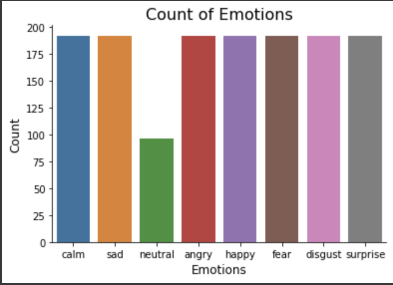

# Описание проекта
## Название проекта: classification-emotional-speech
### Цель: Определить эмоции человека по записи голоса.
### Автор: Герасимчук Михаил Юрьевич (P4141)

Задачи:
1. Анализ существующих решений;
2. Сбор данных;
3. Обучение выбранных моделей;
4. Оценка моделей исходя из показателей полученных метрик (`Precision`, `Recall`, `Accuracy`,`F1-score`) на исходном наборе данных;
5. Выбор наиболее оптимальной модели;
6. Развёртывание наилучшей модели.
  

Датасет: [Kaggle dataset](https://www.kaggle.com/datasets/uwrfkaggler/ravdess-emotional-speech-audio)  
Проект: [classification-emotional-speech](https://github.com/aimspot/classification-emotional-speech)

### Описание датасета и целесообразность его использования:
Датасет содержит 1440 файлов. RAVDESS содержит 24 профессиональных актеров (12 женщин и 12 мужчин), произносящих два лексически соответствующих высказывания на нейтральном североамериканском акценте. 
Речевые эмоции включают:
- Спокойствие;
- Радость;
- Грусть;
- Нейтральная; 
- Злость;
- Страх;
- Удивление;
- Отвращение (см. Рис. 1).

Каждое выражение производится на двух уровнях эмоциональной интенсивности (нормальный, сильный), с дополнительным нейтральным выражением.

Каждый из 1440 файлов имеет уникальное имя файла. Имя файла состоит из 7 числового идентификатора (например, 03-01-06-01-02-01-12.wav). Эти идентификаторы определяют характеристики стимула:

Идентификаторы имени файла:
* Модальность (01 = полный-AV, 02 = только видео, 03 = только аудио);
* Вокальный канал (01 = речь, 02 = песня);
* Эмоция (01 = нейтральная, 02 = спокойная, 03 = радостная, 04 = грустная, 05 = злая, 06 = испуганная, 07 = отвращение, 08 = удивление).
* Эмоциональная интенсивность (01 = нормальная, 02 = сильная). ПРИМЕЧАНИЕ: для эмоции “нейтральная” нет сильной интенсивности;
* Высказывание (01 = “Дети говорят у двери”, 02 = “Собаки сидят у двери”);
* Повторение (01 = первое повторение, 02 = второе повторение);
* Актер (от 01 до 24. Актеры с нечетными номерами - мужчины, с четными номерами - женщины).

Пример имени файла: `03-01-06-01-02-01-12.wav`

Только аудио(03) - Речь(01) - Испуганный(06) - Нормальная интенсивность(01) - Высказывание “собаки”(02) - 1-е повторение(01) - 12-й актер(12) Женский актер, так как номер идентификатора актера четный.

    

Рис.1 Распределение классов в датасете
